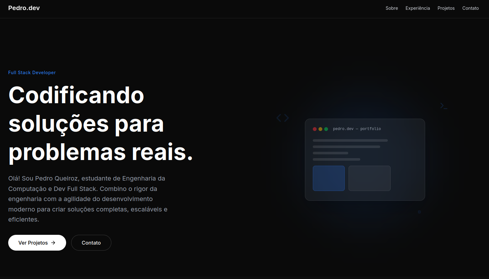

<h1 align="center">PORTIFÓLIO</h1>

Portifolio desenvolvido afim de mostrar um pouco dos projetos que ja realizei e tambem começar em uma nova tecnologia, o React. 

  <a href="#-tecnologias">Tecnologias</a>&nbsp;&nbsp;&nbsp;|&nbsp;&nbsp;&nbsp;
  <a href="#-projeto">Projeto</a>&nbsp;&nbsp;&nbsp;|&nbsp;&nbsp;&nbsp;
  <a href="#-layout">Layout</a>&nbsp;&nbsp;&nbsp;|&nbsp;&nbsp;&nbsp;
  <a href="#memo-licença">Licença</a>

  

 

  

## 🚀 Tecnologias

Esse projeto foi desenvolvido com as seguintes tecnologias:

- HTML
- CSS
- React - Vite
- JavaScript
- Git e Github
- Figma
- React Router Dom
- Node JS

## 💻 Projeto

O projeto foi desenvolvido com o propósito de mostrar um pouco do meu conhecimento e tambem treinar um pouco de React.-[Visite o projeto online]()

## 🔖 Layout

Você pode visualizar o layout do projeto através [DESSE LINK](. É necessário ter conta no [Figma](https://figma.com) para acessá-lo.

## :memo: Licença

Esse projeto está sob a licença MIT.

---
